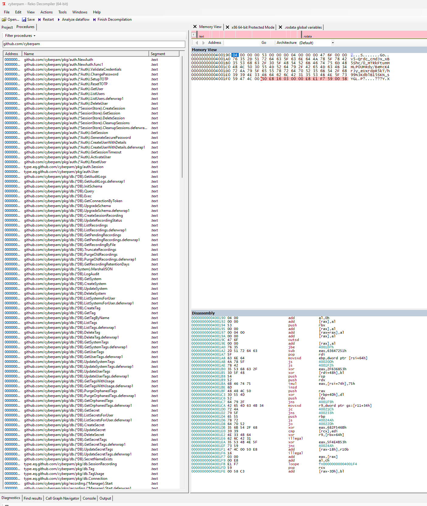
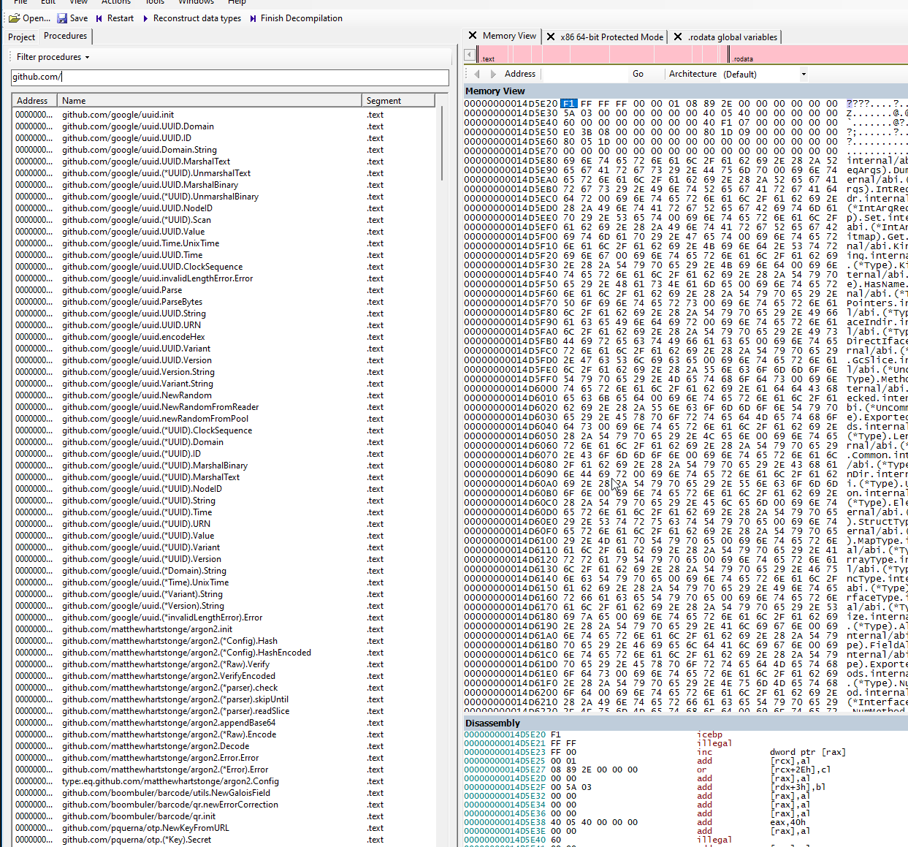

Don't forget critical thinking and cybersecurity aspects when evaluating software. Trust, but verify.

<!-- truncate -->
**I want to start out by saying that I REALLY do not want this to be interpreted as or devolve into any form of hate against the creator or their work. Judging by their Github history alone, they have a quite long track record of awesome open source work, and the scenario "I just felt like uploading all my projects on to Github since recently retiring" is a completely valid scenario. But remember, Github accounts being hacked is also a valid scenario. This is an exercise in caution - Trust, but verify.**

Stumbled over this post that was made recently on here about CyberPAM (github.com/RamboRogers/CyberPAM), and it really sounds like a great piece of software... in theory.

It also sounds a lot like a well-executed training exercise in a cybersecurity lab. Even though someone has a long track record on Github - accounts can be hacked and taken over. 

## The red flags

Here are some of the red flags:

- The RamboRogers github acount does have quite a long history, but a lot of the larger/substantial projects have popped up in the last 3 months
- The first mention of CyberPAM anywhere was 3 months ago. The domain, repo, docker images were all created within the last 3 months.
- Since release, there's a rapid progression through minor versions, 0.3 > 0.4 > 0.5 within about a month. This could just indicate that a lot of features were added since releasing because bugs were discovered, but it might be a flag.
- Releasing the whole thing on Github, with a lot of claims in regards to functionality but little to no documentation or actual source code gives a sense of "this is legit/open source", but without much substance behind it.
- The quote "Often implementations of PAM products take a long time to get to production, but not CyberPAM" - well, generally security products do indeed take a long time to get to production but that's because they are tested quite extensively. It's kind of what I'd expect from a product making a LOT of claims about security features.
- Repetitive mentions of the importance of adding your Cloudflare API keys to the software, with the only substantive documentation helpfully showing you how to do that.
- Very flashy and visually impressive Github repo
- Massive claims on the feature side with a lot of buzzwords
- A sudden shift in programming languages from C++, Shell scripts and some Python/Rust to Go-based software
- A lot of minor changes in a lot of places, the matthewrogers.org domain was modified in december of 2024
- No substantial documentation about the software at all, except for "here's how you run the docker container, here's how your run the container in Kubernetes, here's how you add the Cloudflare API Key"
- The cyberpamagent installation shell script downloads a compiled binary, also without any hint of source code or documentation. The recommended installation method is basically "just run this without thinking about it"
- Everything is compiled and run in a docker container, which is a good practice for security, but also makes it harder to verify what the software is actually doing.

## Inspecting the application for hints
Retrieving and extracting the container image, you'll find the file used to start the container:

```bash
#!/bin/bash

# Ensure absolute paths
DB_PATH="/data/cyberpam.db"
RECORDING_DIR="/recordings"

# Create necessary directories
mkdir -p "$(dirname "$DB_PATH")"
mkdir -p "$RECORDING_DIR"

echo "Starting guacd"
# Start guacd in the background
# -L trace
guacd -f -l 4822 -b 0.0.0.0 &
GUACD_PID=$!

# Change to cyberpam directory
cd /data || exit 1

echo "Starting Cyberpam"
# Start cyberpam with absolute paths
/cyberpam/cyberpam \
    --db-path="$DB_PATH" \
    --recording-dir="$RECORDING_DIR" \
    --guacd-recording-dir="$RECORDING_DIR" &
CYBERPAM_PID=$!

# Monitor both processes
while true; do
    if ! kill -0 $GUACD_PID 2>/dev/null; then
        echo "guacd process died"
        exit 1
    fi
    if ! kill -0 $CYBERPAM_PID 2>/dev/null; then
        echo "cyberpam process died"
        exit 1
    fi
    sleep 5
done
```

Here, you can see a few hints on what's going on. 

### Apache Guacamole

The guacd process is part of Apache Guacamole, where we could easily verify that it is a genuine binary by checking the hash value of the binary against the official one

```bash
$ sha256sum /usr/sbin/guacd
b2999d34f7bd8227d7f0ca4b8d9b7c603eba2adf50aa8c1151b5729e5e180b93  usr/sbin/guacd
```

Now, finding the right version of guacd is a bit trickier. The google search turns up nothing on the hash value - but after running guacd in a separate (secure) container we see the version is 1.5.5

```bash
a0a0a0b1b1:/# guacd -v
Guacamole proxy daemon (guacd) version 1.5.5
```

We can then compare it to the hash value on the official container

```bash
$ docker run --rm -it --entrypoint="" guacamole/guacd:1.5.5 sha256sum /opt/guacamole/sbin/guacd
5140a7ff1d2a75de5433f40e44e9cd4722ce4945f120e664ae61dfca5e4c7801  /opt/guacamole/sbin/guacd
```

Not matching either. Now, this could be due to a number of different reasons. Let's look into the image build process and see if we can find anything else:

```
1 ADD alpine-minirootfs-3.21.2-x86_64.tar.gz / # buildkit
```

Looks like the image is based on the alpine:3.21.2 image. Let's see what happens when we start that and install guacamole-server

```bash
$ docker run --rm -it alpine:3.21.2 sh
  $ apk add guacamole-server
  $ sha256sum usr/sbin/guacd
  b2999d34f7bd8227d7f0ca4b8d9b7c603eba2adf50aa8c1151b5729e5e180b93  usr/sbin/guacd
```

That's good news, so the guacd binary is legit. Let's look at the cyberpam binary to see what we can learn


### The Binary
Reading the content of a compiled Go binary is a bit tricky, but we have some tools that can help us get an idea of what's going on. One of those tools is `Reko Decompiler`, which can be used to peek inside the binary.



Here, we can see a list of some of the functions that are in the binary. The names do indicate that there is a lot of the functionality we'd expect to be in software like this, SetupTOTP, Get/Create/DeleteSession, List and Purge Recordings, List/Get secrets and so on. This lends some credibility to the software being legit, but since we don't really know what happens in these functions yet it doesn't tell us much about whether it's safe or not.

We can also see that the internal packages that are referenced are in the `github.com/cyberpam` namespace. This namespace is occupied by someone other than the author, which does raise some concerns. When installing these packages, an unresolved local reference might lead to packages being pulled from github.com/cyberpam/... instead of the original author. Considering this is a security product, this would be considered a major concern.

We can also see references to other packages



This includes packages like:
- `github.com/google/uuid` - A package for generating and handling UUIDs
- `github.com/pquerna/otp` - A package for handling OTPs (One Time Passwords)
- `github.com/mattn/go-sqlite3` - A package for SQLite3 database handling
- `github.com/gorilla/mux` - A package for handling HTTP routing and URL matching
- `github.com/gorilla/websocket` - A package for handling WebSocket connections
- `github.com/sirupsen/logrus` - A package for structured logging
- `github.com/wwt/guac` - A package for handling Guacamole connections

All of these are legit, third-party packages.

In summary, this means there was a fair bit of effort to at least make this look legitimate, but an alternative interpretation could be that this is an existing product that has been modified to look like a new one. Since we can't really inspect everything that's happening in-depth, this is a difficult determination.


## Conclusion

Now, how you interpret all of this is up to you.

Most of the points could be covered in the scenario you get when reading his various posts, "I recently retired, I've been using this for years, I just wanna share it with the community". This isn't unreasonable at all. Releasing software without the source code on Github, or bulk uploading projects aren't red flags in itself.

The contents of the binary do lend a fair bit of credibility to this being legitimate, but when assessing risk the surrounding factors do paint a different picture.

But the scenario of "Yeah, this will likely infiltrate your network and Cloudflare account" is equally likely at this point. Matthew could be away for a couple of months on holiday and his account was hacked, he could've finally snapped after retiring from working for EvilCorp for years, maybe it's not really his account at all, or maybe he's running a cybersecurity PSA just for laughs.

Trust - but verify.
